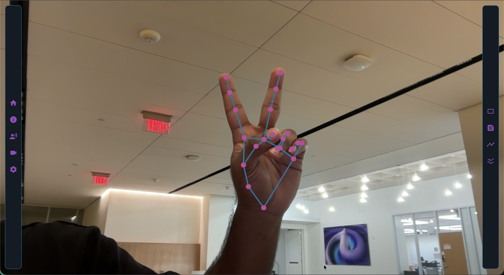

# C.Y.R.U.S.

**C.Y.R.U.S.** (Cybernetic Responsive Utility System) is a real-time, computer-vision and gesture-control assistant built around a lightweight hand keypoint-classification pipeline with a simple web interface. It recognizes hand gestures from a webcam stream and maps them to actions in your application stack.

> Licensed under the Apache License, Version 2.0.

---

## Table of Contents
- [Overview](#overview)
- [Features](#features)
- [Architecture](#architecture)
- [Getting Started](#getting-started)
  - [Prerequisites](#prerequisites)
  - [Installation](#installation)
  - [Quick Start](#quick-start)
- [Usage](#usage)
  - [Web UI](#web-ui)
  - [API](#api)
  - [Training & Notebooks](#training--notebooks)
- [Repository Layout](#repository-layout)
- [Configuration](#configuration)
- [Performance Notes](#performance-notes)
- [Roadmap](#roadmap)
- [Contributing](#contributing)
- [License](#license)
- [Acknowledgments](#acknowledgments)
- [Contact](#contact)

---

## Overview
C.Y.R.U.S. performs real-time hand-keypoint detection in the browser or server, feeds normalized landmarks into a classifier, and returns a gesture label plus confidence scores. The project provides:

- A Python web app to serve a responsive UI and REST endpoints  
- A gesture classification pipeline backed by notebooks for training and evaluation  
- Clean HTML/CSS templates for a plug-and-play demo



---

## Features
- **Real-time gesture recognition** using 2D hand landmarks and a lightweight classifier.
- **Action mapping** so each recognized gesture can trigger custom application logic (keyboard/media controls, HTTP webhooks, smart-home, shell commands, etc.).
- **Browser-based demo** with webcam capture, live predictions, and probability readouts.
- **Reproducible training** via Jupyter notebooks for data processing, model training, and evaluation.
- **Portable stack** (Python web server + vanilla HTML/CSS/JS) for easy deployment on laptops, edge devices, or containers.
- **Modular design** to swap models, add gestures, or integrate with external services.

**Example use cases**
- Hands-free UI: scroll/confirm/cancel/next-slide  
- Content control: play/pause, mute, next/prev track  
- Robotics / IoT: trigger GPIO, send MQTT/HTTP commands  
- Research & prototyping: HCI experiments, accessibility interfaces

---

## Architecture

**High-level flow**
1. **Frame capture** in the browser (webcam).
2. **Landmark extraction** from each frame.
3. **Feature engineering** (normalization, distances/angles, optional temporal smoothing).
4. **Classification** into one of the trained gesture classes.
5. **Action dispatch** based on the predicted label.

**Components**
- **`webapp.py`**: Python web application that serves the UI and exposes REST endpoints.
- **Templates**: `templates/index.html` and `test.html` for the user interface.
- **Static assets**: `static/stylesheet.css` plus images and client-side scripts.
- **Notebooks**: `keypoint_classification.ipynb` and `keypoint_classification_EN.ipynb` to train/evaluate the classifier.

> Swap models or add new gestures by retraining in the notebooks and loading the new artifact in the app.

---

## Getting Started

### Prerequisites
- Python ≥ 3.9
- pip
- A webcam for the browser demo

### Installation
```bash
python -m venv .venv
source .venv/bin/activate  # Windows: .venv\Scripts\activate
pip install -r requirements.txt
```

### Quick Start
```bash
python webapp.py
```
Then open `http://localhost:5000` in your browser.

---

## Usage

### Web UI
- Launch the app and allow camera access in your browser.
- The live preview displays your hand, the predicted gesture label, and confidence.
- Use the on-screen controls (if present) to toggle prediction, view logs, or sample frames.

### API
Minimal REST surface for integration/testing (adjust if your routes differ):

**Health check**
```http
GET /health
```

**Predict** — submit normalized 2D landmarks to get a gesture prediction.
```http
POST /predict
Content-Type: application/json

{
  "landmarks": [
    [x0, y0], [x1, y1], ..., [x20, y20]
  ]
}
```

**Response**
```json
{
  "label": "thumbs_up",
  "scores": {"thumbs_up": 0.92, "open_palm": 0.06, "fist": 0.02}
}
```

> Endpoint names and payloads can be adjusted in `webapp.py`.

### Training & Notebooks
Open either notebook to train or update the classifier:

- **Data prep**: load/export labeled landmarks
- **Feature engineering**: normalization, distances/angles, smoothing
- **Training**: choose a model family (e.g., MLP/SVM/RandomForest) and tune hyperparameters
- **Evaluation**: confusion matrix, per-class precision/recall, latency
- **Export**: save the trained artifact for the web app to load

Run the notebooks locally (VS Code, JupyterLab, or classic Jupyter).

---

## Repository Layout
```
.
├── README.md
├── LICENSE
├── .gitignore
├── webapp.py
├── templates/
│   ├── index.html
│   └── test.html
├── static/
│   ├── stylesheet.css
│   └── image.png
├── keypoint_classification.ipynb
└── keypoint_classification_EN.ipynb
```

---

## Configuration
Common knobs you may wish to adjust:

- **Server**: host, port, and debug mode in `webapp.py` or environment variables
- **Model path**: file path to the trained classifier artifact
- **Class names**: list of labels expected by the classifier
- **Smoothing**: temporal window size and thresholding for more stable labels
- **Action mapping**: map gesture labels to functions or external hooks

**Example mapping pattern inside your server code:**
```python
GESTURE_ACTIONS = {
    "open_palm": "toggle_play_pause",
    "fist": "mute",
    "thumbs_up": "confirm",
    "thumbs_down": "cancel",
    "v_sign": "next"
}
```

---

## Performance Notes
- Keep landmark normalization consistent between training and inference.
- Apply a short temporal smoothing window to reduce flicker.
- Balance classes during training to avoid bias toward frequent gestures.
- Profile end-to-end latency and batch operations where possible.

---

## Roadmap
- Multi-hand and multi-person support
- Additional gesture classes and auto-labeling utilities
- Optional 3D landmark features and pose fusion
- Pluggable “actions” SDK for common integrations
- Packaging as a Python wheel and/or Docker image

---

## Contributing
Contributions are welcome. Please open an issue or pull request with a clear description and, where applicable, tests or repro steps.

1. Fork the repository  
2. Create a feature branch  
3. Commit changes  
4. Open a pull request

---

## License
This project is licensed under the Apache License, Version 2.0. See the `LICENSE` file for details.

---

## Acknowledgments
- Landmark detection and hand-pose research that inspired this project  
- Open-source contributors in computer vision and HCI communities

---

## Contact
Open an issue in the repository for bugs, questions, or feature requests.
